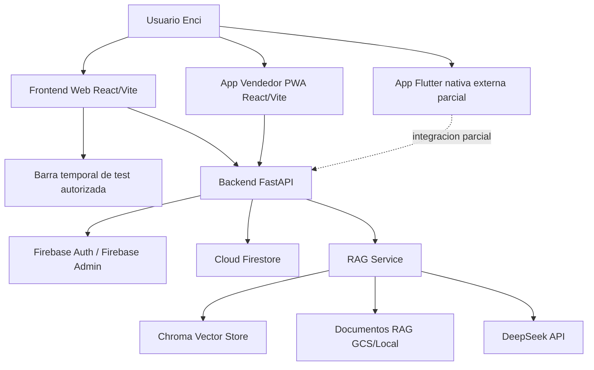

# Arquitectura final verificada

## Componentes

1. Usuario Enci: accede al CRM web y/o PWA.
2. Frontend web React/Vite: CRM, dashboards, usuarios, clientes, comercial, RAG.
3. Barra temporal de test: autorizada, pendiente de retiro manual final, no modificada.
4. App Vendedor/PWA React/Vite: experiencia movil dentro del repo.
5. App Flutter nativa: entregable externo parcial, no versionado aqui.
6. Backend FastAPI: API REST y control de negocio.
7. Firebase Auth: login Google.
8. Firebase Admin: validacion de ID Token en backend.
9. Firestore: datos de usuarios, clientes, comercial y RAG.
10. RAG: chat, historial, upload, reindex, documentos.
11. DeepSeek: proveedor LLM backend.
12. Chroma: indice vectorial configurable.
13. GCS/local storage: almacenamiento documental segun ambiente.
14. Vercel: frontend web y PWA.
15. Cloud Run/Render: backend objetivo compatible.

## Flujos

- Auth: Google SSO -> Firebase ID Token -> FastAPI -> Firestore -> rol/estado.
- Clientes: frontend/PWA -> API `/clientes` -> Firestore -> permisos por rol/propiedad.
- Comercial: oportunidades/propuestas/interacciones -> API -> Firestore -> auditoria.
- Usuarios/roles: admin -> `/users/*` -> Firestore/Firebase Admin.
- RAG: usuario -> `/rag/chat` -> Chroma/contexto interno -> DeepSeek o fallback local -> historial.
- Deploy: build Vite -> Vercel; FastAPI -> runtime ASGI; env vars -> plataforma.

## Limites de entrega

El repo queda listo para UAT/go-live condicionado. No incluye Flutter nativo versionado, offline total, SAP, Calendar, WhatsApp, mapas avanzados, OCR, firma digital, BI extendido ni SLA IA productivo.
